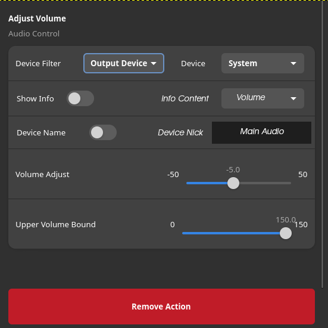

= Checklist 2.4 Update

== Checklist

- [X] UI Improvements
- [X] Add Standard Device Controls
- [X] Improve device name system
- [ ] Create better store Thumbnail
- [X] Update Actions to use new System

=== UI Improvements
Make the overall UI cleaner and nicer to use. The Mock included is a rough guideline how the new UI should look but can  be modified to fit certain needs that may come up in development.

.New UI Mockup

=== Standard Device Controls
Add a new Device called Standard that will automatically use the current standard device to modify/display values

=== Device Name System
Taking a look at the way I display device names in the dropdown. There is an improved version that is not in the store, so taking another look at it is a good idea to make sure its of good quality

=== Store Thumbnail
The current store thumbnail is very simple can be improved visually in a few ways

=== Update Actions
Because the UI improvements overall made it so that one Base Class got rewritten the actions need to get updated to the new class aswell